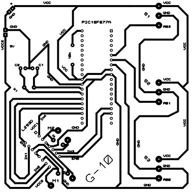
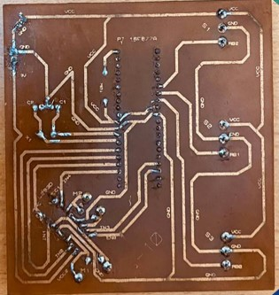
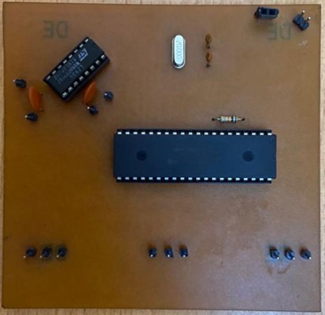
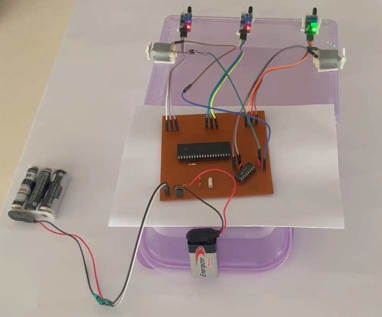
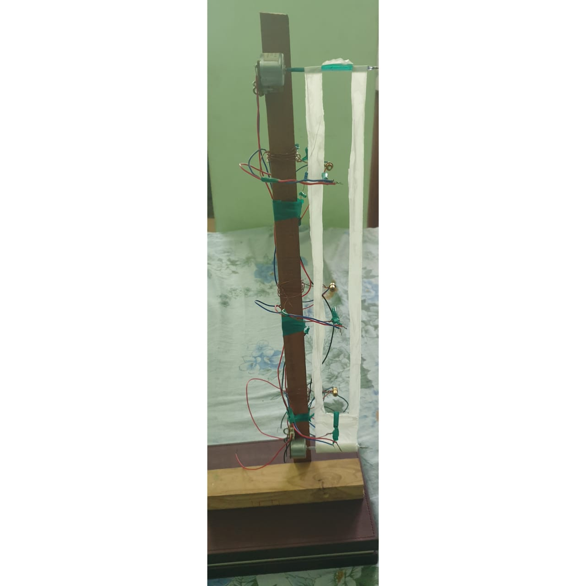

# Microcomputers_Lab4_Report

## Introduction 
This laboratory is a good example of the external interrupt routine usage in a practical situation. We have a water tank which detects water level from three switches, when the bottom switch is on, water is filled and it continues to fill even when middle switch turns on. But when the third switch turns on, the interrupt (RB0 external interrupt) runs, which removes water from tank for 500 ms or simply half a second. Our task was to create a PCB which a PIC16F877A microcontroller can mount on, and send signals to do the above operation.

## Image of the PCB design


## Image of the real implementation
### Track Side of PCB


### Component Side of PCB


## Full Implementation


## An Implemented Modal


## Another Circuit(Breadboard)


## Results
The PCB circuit is working as intended. The code was made in such a way that, if the switches were to input anything other than the updated truth table values given, it will momenterally turn off all operations until the input matches with what is needed again. This is because, in a practical situation, this could be due to a malfunction, and operation during a malfunction is generally not a good idea. In addition this function and our task mentioned at the introduction, this implemented PCB circuit does them fine.

The other implemented modal is to represent the water tank, if this was an actual scenario. When this modal is running, you can see that when the representive water level reaches the top switch 3, the water level drops down just filled to switch 3 level again, and this continues on in an oscillatory fashion. The other circuit which runs the motors by using transistors instead of using a motor controller like the PCB design is used here, because the motors used are very low power.

So essentially, both implmetations yeilded good results, as the first PCB circuit with its implementation allowed us to test the code. While, the other modal showed how this would function in the practical situation. Also, creating two circuits with different methods to run the motors gave us good insight.

## Code Used for The Full Implementation
* This had to be changed from the uploaded Proteus tested code, because of the usage of IR sensors and Motor controller IC in the PCB circuit.  
```c
// PIC16F877A Configuration Bit Settings

// 'C' source line config statements

// CONFIG
#pragma config FOSC = HS        // Oscillator Selection bits (HS oscillator)
#pragma config WDTE = OFF       // Watchdog Timer Enable bit (WDT disabled)
#pragma config PWRTE = OFF      // Power-up Timer Enable bit (PWRT disabled)
#pragma config BOREN = OFF      // Brown-out Reset Enable bit (BOR disabled)
#pragma config LVP = OFF        // Low-Voltage (Single-Supply) In-Circuit Serial Programming Enable bit (RB3 is digital I/O, HV on MCLR must be used for programming)
#pragma config CPD = OFF        // Data EEPROM Memory Code Protection bit (Data EEPROM code protection off)
#pragma config WRT = OFF        // Flash Program Memory Write Enable bits (Write protection off; all program memory may be written to by EECON control)
#pragma config CP = OFF         // Flash Program Memory Code Protection bit (Code protection off)

// #pragma config statements should precede project file includes.
// Use project enums instead of #define for ON and OFF.
#define _XTAL_FREQ 20000000 

#include <xc.h>

void __interrupt() isr(void){  //ISR
    if(INTF==1){     //CHECK IF THE INTERRUPT IS ON
        INTF = 0;    //CLEAR THE INTERRUPT
        
        if(RB2==0 && RB1==0){
          //MOTOR 1 OFF
        RC0 = 0;   //IN2 LOW
        RC1 = 0;   //IN1 LOW
        
          //MOTOR 2 ON
        RC3 = 1;   //IN4 HIGH
        RC5 = 0;   //IN3 LOW
        __delay_ms(500);   //MOTOR 2 ON FOR 500ms
        RC3 = 0;   //IN4 LOW
        
        }
    }
}
      
void main(void){
    TRISB0 = 1;   //SENSOR 3
    TRISB1 = 1;   //SENSOR 2
    TRISB2 = 1;   //SENSOR 1
    
    TRISC0 = 0;   //IN2
    TRISC1 = 0;   //IN1
    TRISC3 = 0;   //IN4
    TRISC5 = 0;   //IN3
    INTF = 0;     //CLEAR THE INTERRUPT
    
    GIE = 1;    //ENABLE GLOBAL INTERRUPT BIT
    PEIE = 1;   //ENABLE THE PERIPHERAL INTERRUPT BIT
    INTE = 1;   //ENABLE RB0 AS EXTERNAL INTERRUPT BIT
    INTEDG = 0; //EXTERNAL INTERRUPT ON RB0 IS TRIGGERED BY FALLING SIGNAL EDGE
    
    PORTC = 0X00;  //PORTC LOW
    while(1){
        RC0 = 0;   //IN2 LOW
          //MOTOR 2 OFF
        RC3 = 0;   //IN3 LOW
        RC5 = 0;   //IN4 LOW
        
        if(RB2==0 && RB1==1 && RB0==1){
              //MOTOR 1 ON
            RC1 = 1;   //IN1 HIGH
        }else if(RB2==0 && RB1==0 && RB0==1){
              //MOTOR 1 ON
            RC1 = 1;   //IN1 HIGH
        }else{
            PORTC = 0X00;  //PORTC LOW
        }
    }
}
```

## Code Used for The Practical Modal
* For this, the Proteus tested code uploaded before works perfectly fine(which was uploaded into the breadboard circuit).
```c
// PIC16F877A Configuration Bit Settings

// 'C' source line config statements

// CONFIG
#pragma config FOSC = HS        // Oscillator Selection bits (HS oscillator)
#pragma config WDTE = OFF       // Watchdog Timer Enable bit (WDT disabled)
#pragma config PWRTE = OFF      // Power-up Timer Enable bit (PWRT disabled)
#pragma config BOREN = OFF      // Brown-out Reset Enable bit (BOR disabled)
#pragma config LVP = OFF        // Low-Voltage (Single-Supply) In-Circuit Serial Programming Enable bit (RB3 is digital I/O, HV on MCLR must be used for programming)
#pragma config CPD = OFF        // Data EEPROM Memory Code Protection bit (Data EEPROM code protection off)
#pragma config WRT = OFF        // Flash Program Memory Write Enable bits (Write protection off; all program memory may be written to by EECON control)
#pragma config CP = OFF         // Flash Program Memory Code Protection bit (Code protection off)

// #pragma config statements should precede project file includes.
// Use project enums instead of #define for ON and OFF.
#define  _XTAL_FREQ 20000000

#include <xc.h>

void __interrupt() isr(void) //ISR
{
    if (INTF==1) //Check if the interrupt is On
    {
        RC1=0; // Motor 1 if OFF
        INTF=0; //Clear the interrupt
        if (RB2==1 && RB1==1) { //Check if Switch 1 and Switch 2 is ON, if true, run the code below
            RC1=0; // Motor 1 is OFF 
            RC0=0; // Motor 2 is OFF
            RC0=1; // Motor 2 is ON
            __delay_ms(500);  //Motor 2 is kept ON for 500ms
            RC0=0;    //Motor 2 is off
        }
    }
}
        

void main(void)
{
    TRISB0 = 1; //Pin 0 of the PortB is the Switch 3
    TRISB1 = 1; //Pin 1 of the PortB is the Switch 2
    TRISB2 = 1; //Pin 2 of the PortB is the Switch 1
    
    TRISC0 = 0; //OUTPUT for Motor 2
    TRISC1 = 0; //Output for Motor 1
    
    RC2=0; //Motor 1 OFF
    GIE=1;   //Enable global interrupt-Enables all unmasked interrupt
    PEIE=1;  //Peripheral Interrupt enable-Enables all unmasked peripheral interrupts
    INTE =1; //Enable RB0 interrupt -  Enables the RB0 external interrupt
    INTF = 0; //Making sure interrupt is cleared first
 while(1)
 {
    RC0=0; //Motor 2 OFF
    
    if(RB2==1 && RB1==0 && RB0==0){  //Check if only Switch 1 is ON
        RC1=1;   //If so, turn Motor 1 ON   
    }
    else if(RB1==1 && RB2==1 && RB0==0) { //Check if only Switch 1 and Switch 2 is ON 
        RC1=1;   //If so, turn Motor 1 ON
    }
    else {
        RC1=0; //If above conditions didn't happen, it is a fault in the system/Switches, so turn Motor OFF
    }
 }
 return;
}
```
